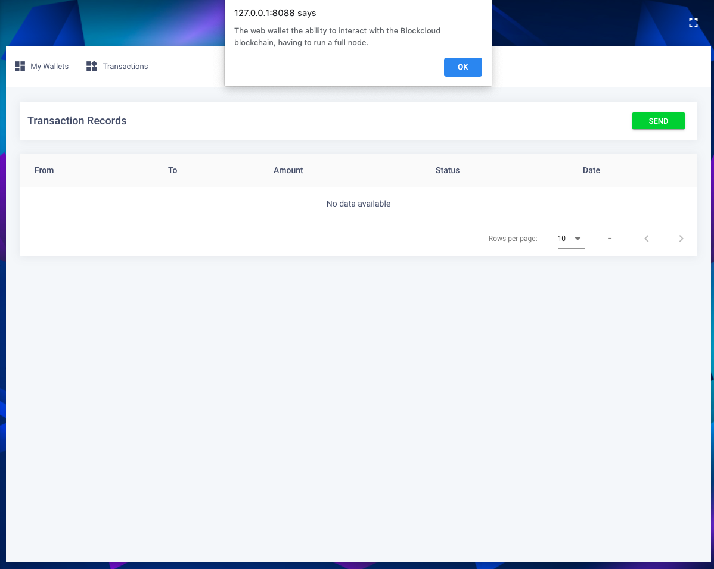
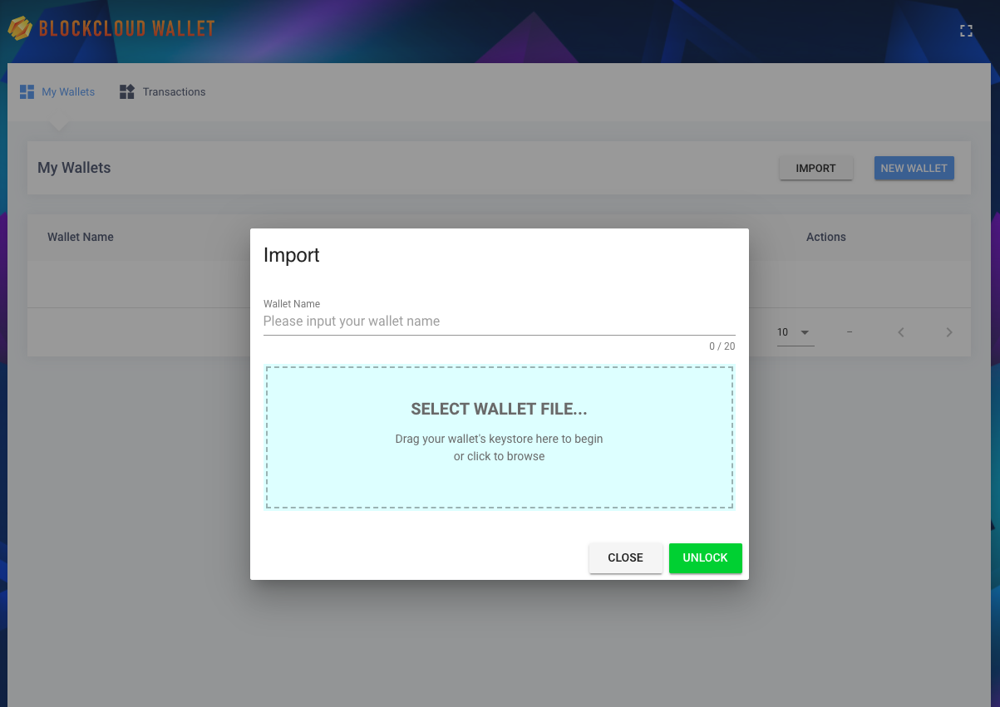
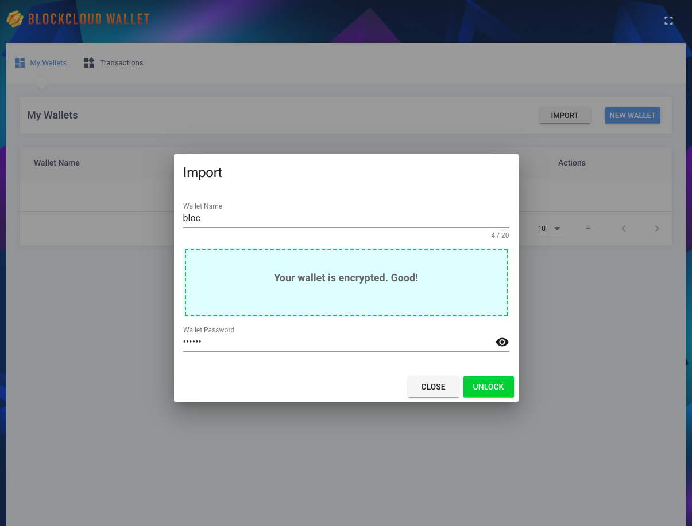
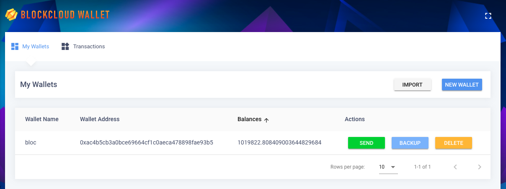
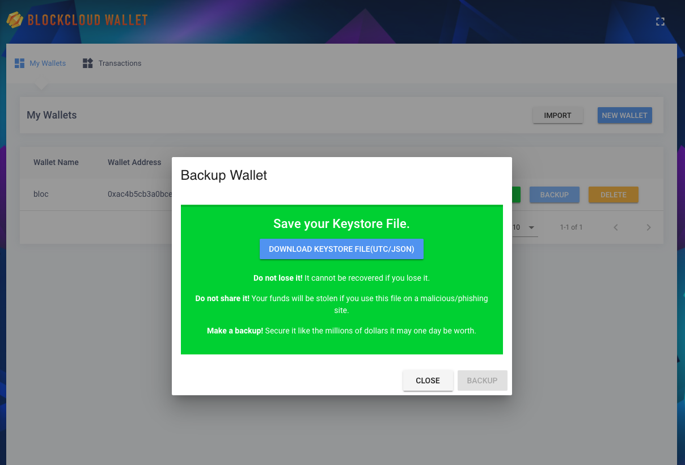
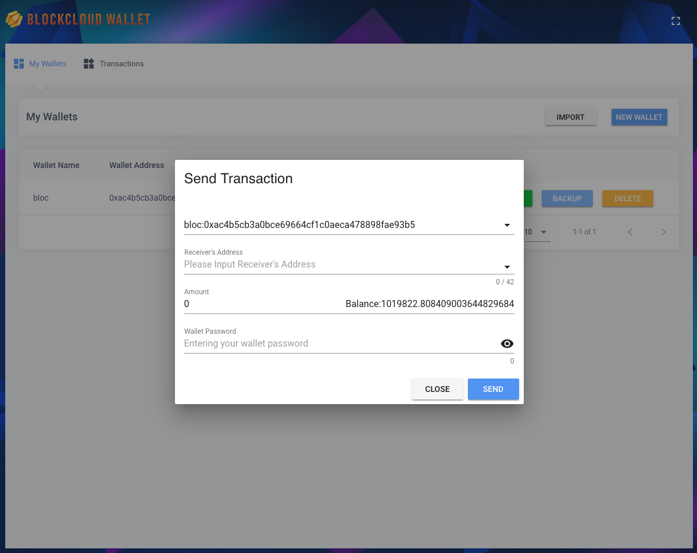
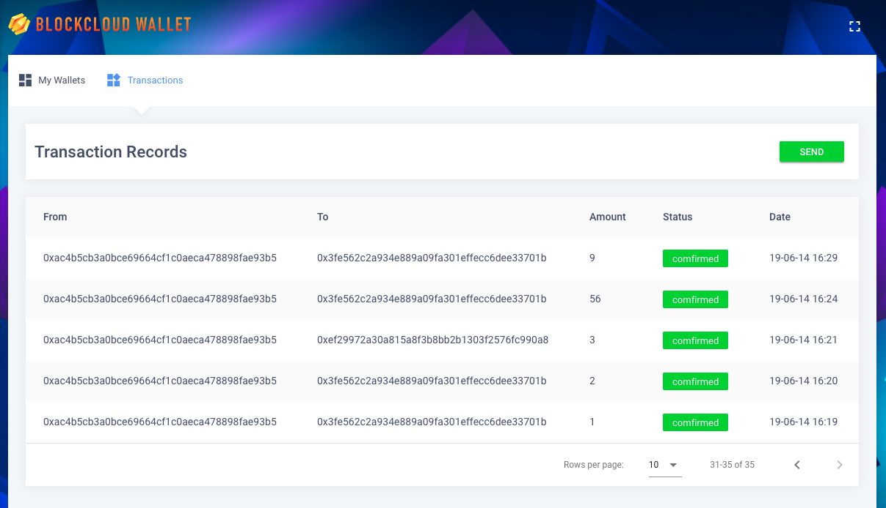

# web-wallet

This is Blockcloud web wallet, enabling users to manage their own funds without a centralized platform. A CoDag full node is required to support the wallet.

This is a free, client-side interface to interact with the Blockcloud blockchain.

## Getting started

### Installation

1. **Install Node.js and NPM**: Download Node.js Recommended Version from https://nodejs.org/en/download/ and install it on your system. NPM comes bundled with Node.js.

2. **Install npm packages** : Open your terminal, go to the root directory of the project and run `npm install`. All the dependencies will be downloaded under node_modules folder. Please wait for it to finish.

### Running Development Server

Run `npm run serve`. Once it completes, access http://localhost:8088/ to run wallet on your browser. The application will automatically reload if you make any changes in any of the source file.

### Building:

Run `npm run build` to build the wallet. The built program will be stored in the `dist/` directory.

## Configuration

Your can configure the wallet by modifying [vue.config.js](/vue.config.js). Delete proxy's comments and add a Blockcloud JSON-RPC host.

```
proxy: {
    "/api": {
        target: "", //Blockcloud JSON-RPC host
        changeOrigin: false,
        pathRewrite: {
            "^/api": ""
        }
    }
}
```

## Wallet UI

### Running (without Blockcloud JSON-RPC host)



### Running (with a Blockcloud JSON-RPC host)

#### My Wallets (import a wallet)



-   Upload keystore file

    

-   Import succeeded

    

#### My Wallets (backup wallet)



#### Transactions (token transfer)



#### Transactions (records)


